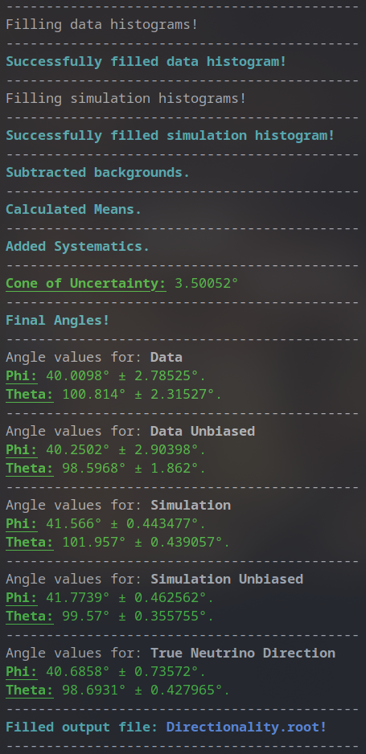

<p align="center">
    
</p>

---

<h1 align="center">
    <br>
    (Anti)Neutrino Directionality Study
    <br>
</h1>

<h2 align="center">
    Calculating the average antineutrino direction in the PROSPECT detector. The source is the HFIR reactor. The reconstructed direction is achieved by tracking average delayed neutron displacement from the prompt positron in Cartesian before converting the coordinates to spherical. Paper in progress. 
</h2>

<h2>
    Summary
</h2>

The analysis code first reads analyzed PROSPECT data passed through the analysis framework PROSPECT2x and creates histograms to track the average displacement between the prompt and delayed events. The *x* and *y* positions are approximated as the midpoint of the segment in which the events occurred. The inoperative segments requires a more complex selection of events, which will be described in the paper. This also leads to a more complex error calculation which is outlined in the code. After the events are counted, the background subtraction is carried to get the IBD signal events which are then put through the error calculations and angle reconstructions. 

<h2>
    Requirements
</h2>

* ROOT 5+
* C++ compliler (I'm using g++ in the instructions)
* Analyzed and calibrated PROSPECT data 

<h2>
    How To Use (Debian)
</h2>

```bash
# Clone this repository
git clone https://github.com/shayshunk/NeutrinoDirectionality

# Go into the repository
cd NeutrinoDirectionality

# Install dependencies (quick way below but not recommended)
# Go here to find the CERN recommended way: https://root.cern/install/
sudo snap install root-framework

# Edit the header NeutrinoDirectionality.h to point to your data files
# Line 26-29 contain my local paths but yours will be different

# Run the code
# I'm using g++ because it's straightforward but you can configure another compiler
g++ NeutrinoDirectionality.cc -o Directionality `root-config --cflags --glibs`
./Directionality

# Make the plots
g++ NeutrinoDirectionalityPlots.cc -o Plots `root-config --cflags --glibs`
./Plots
```

<h2>
Customization Options
</h2>

A few preprocessor options are available for customizing the output of the code. The lines (6-10) in `NeutrinoDirectionality.cc` let you define how verbose you want the output of the values calculated to be.

```C++
#define COVARIANCE_VERBOSITY 0
#define IBDCOUNT_VERBOSITY 0
#define MEAN_VERBOSITY 0
#define LIVETIME_VERBOSITY 0
#define DETECTOR_VERBOSITY 0
```
With all options set to 0, the output will only print what step it's currently on. Set to 1, the options do as follows:

 * `COVARIANCE_VERBOSITY 1` will print out the semi-major axes of the 1-sigma ellipse that the plots show. Note that these are not the errors on the angles individually but due to covariance in the angle calculations, the 68% C.L. ellipse combining both angles is a different shape and size than just using the errors on the angles as the semi-major axes. 
 * `IBD_COUNT VERBOSITY 1` will print the total and effective IBDs in each direction for each dataset. Effective IBDs are calculated through Poisson statistics. 
 * `MEAN_VERBOSITY 1` will print the *p* components and respective errors that are calculated prior to the addition of systematics. These components are then used to calculate the tangents of the angles. More details in the paper. 
 * `LIVETIME_VERBOSITY 1` will print the total livetime for all Reactor On and Reactor Off events. 
 * `DETECTOR_VERBOSITY 1` will print the detector configurations for each period of PROSPECT data. These are available on the PROSPECT docdb. 

The other option is contained in `Formatting.h`. I added a few quick functions that return a certain formatting (bold/underline) or color for more aesthetically pleasing output. These only work on Linux terminals. If working on another platform or the output simply looks jumbled or unpleasant, turn off the special formatting on line 4 by setting it to 0.

```C++
#define COLORFUL_FORMATTING 1
```

<h2>
Sample Output
</h2>

This is the final output of `NeutrinoDirectionality.cc` with the current dataset and angle calculation methods. All preprocessor flags above are set to 0 except for `COLORFUL_FORMATTING`. 


<p align="center">
    
</p>

This the final plot as of now, though it is to subject to change as the paper develops.

<p align="center">
    
</p>

---
